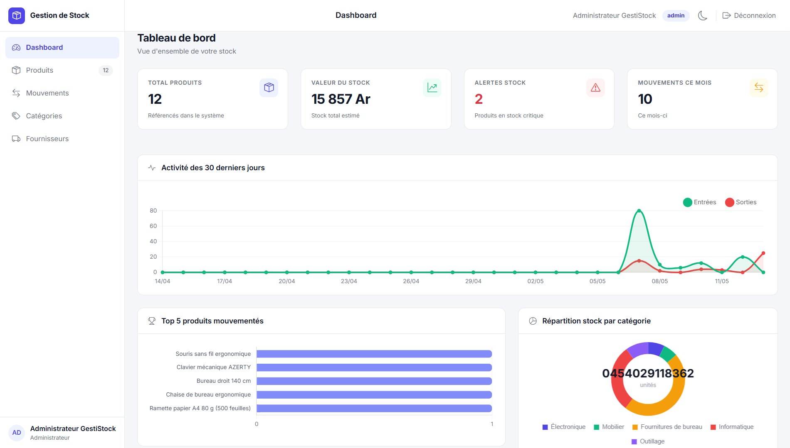
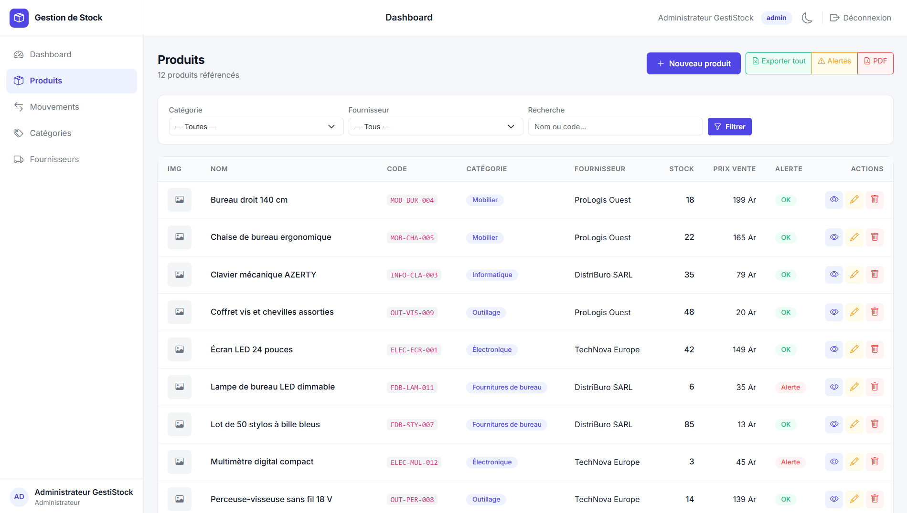
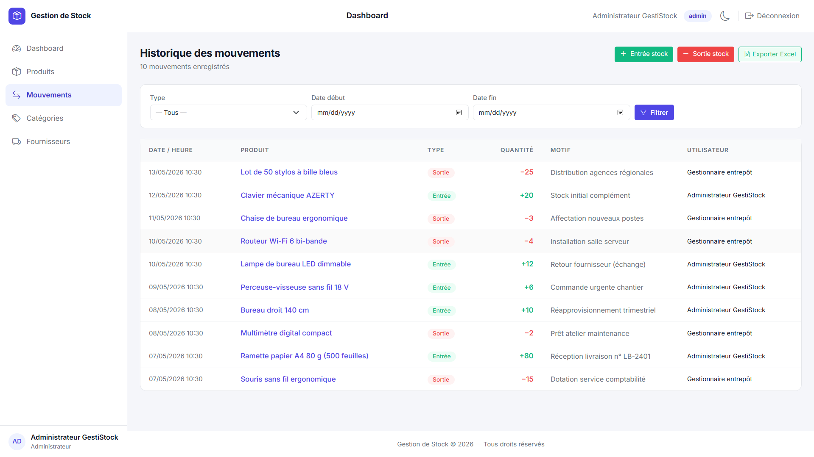
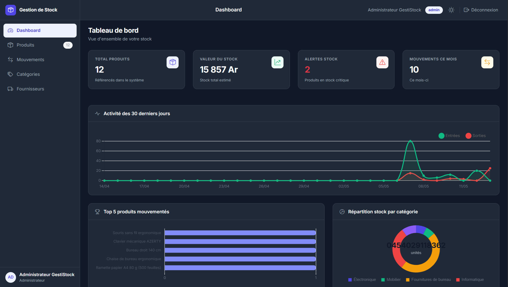

# Gestion de Stock — Application Laravel 12

<div align="center">

[](https://laravel.com)
[](https://php.net)
[](https://mysql.com)
[](https://getbootstrap.com)
[](LICENSE)
[]()

Application web de gestion de stock développée avec Laravel 12 dans le cadre d'un projet de fin de Licence 3 Informatique.

</div>

---

## Apercu


*Tableau de bord avec statistiques, graphiques animés et alertes de stock critique*


*Gestion des produits avec filtres, badges de statut et actions rapides*


*Historique complet des entrées, sorties et ajustements de stock*


*Interface en mode sombre, mémorisé entre les sessions*

---

## Fonctionnalites

| Fonctionnalité | Description |
|---|---|
| Authentification | Connexion et déconnexion sécurisées via Laravel Breeze |
| Gestion des rôles | Administrateur (accès complet) et Gestionnaire (lecture + mouvements) |
| Protection des routes | Middleware Spatie par rôle sur toutes les routes sensibles |
| CRUD Produits | Création, modification, suppression avec upload d'image |
| CRUD Catégories | Gestion des catégories avec compteur de produits liés |
| CRUD Fournisseurs | Gestion des fournisseurs avec coordonnées et compteur produits |
| Entrées de stock | Enregistrement des réapprovisionnements avec motif |
| Sorties de stock | Enregistrement des sorties avec vérification du stock disponible |
| Ajustements | Correction manuelle du stock avec justification obligatoire |
| Tableau de bord | 4 métriques clés, 3 graphiques Chart.js animés, alertes critiques |
| Alertes automatiques | Détection et affichage des produits sous le seuil d'alerte |
| Historique par produit | Traçabilité complète avec timeline et statistiques par produit |
| Recherche globale | Recherche en temps réel dans la navbar (produits, catégories, fournisseurs) |
| Export Excel | Export des produits et de l'historique des mouvements avec filtre par dates |
| Export PDF | Rapport des alertes et fiche individuelle par produit |
| Mode clair / sombre | Thème mémorisé dans le navigateur via localStorage |
| Interface responsive | Compatible desktop et tablette via Bootstrap 5 |

---

## Stack technique

| Technologie | Version | Usage |
|---|---|---|
| Laravel | 12.x | Framework backend principal |
| PHP | 8.2 | Langage serveur |
| MySQL | 8.0 | Base de données relationnelle |
| Bootstrap | 5.3 | Interface et mise en page |
| Bootstrap Icons | 1.11 | Icônes de l'interface |
| Chart.js | 4.x | Graphiques animés du tableau de bord |
| Laravel Breeze | 2.x | Authentification |
| Spatie Laravel Permission | 6.x | Gestion des rôles et permissions |
| Maatwebsite Excel | 3.x | Export au format Excel (.xlsx) |
| Barryvdh DomPDF | 2.x | Génération de rapports PDF |

---

## Installation

### Prérequis

- XAMPP avec PHP 8.2 ou supérieur et MySQL
- Composer
- Git

### Étapes

**1. Cloner le dépôt**

```bash
git clone https://github.com/zomanorj/gestion-stock.git
cd gestion-stock
```

**2. Installer les dépendances PHP**

```bash
composer install
```

**3. Configurer l'environnement**

```bash
cp .env.example .env
php artisan key:generate
```

Ouvrir le fichier `.env` et renseigner les paramètres de base de données :

```env
APP_NAME="Gestion de Stock"
APP_URL=http://127.0.0.1:8000

DB_CONNECTION=mysql
DB_HOST=localhost
DB_PORT=3306
DB_DATABASE=gestion_stock
DB_USERNAME=root
DB_PASSWORD=

CACHE_DRIVER=file
SESSION_DRIVER=file
```

**4. Créer la base de données**

Ouvrir phpMyAdmin (`http://localhost/phpmyadmin`) et créer une base de données nommée `gestion_stock` avec l'encodage `utf8mb4_unicode_ci`.

**5. Exécuter les migrations et les données de démonstration**

```bash
php artisan migrate
php artisan db:seed
php artisan storage:link
```

**6. Lancer l'application**

```bash
php artisan serve
```

L'application est accessible à l'adresse `http://127.0.0.1:8000`.

---

## Comptes de demonstration

| Rôle | Email | Mot de passe | Accès |
|---|---|---|---|
| Administrateur | admin@gestistock.com | password | Accès complet — CRUD, exports, ajustements |
| Gestionnaire | gestionnaire@gestistock.com | password | Lecture et mouvements de stock uniquement |

---

## Structure du projet

```
gestion-stock/
├── app/
│   ├── Exports/                  # Classes d'export Excel
│   ├── Http/
│   │   ├── Controllers/          # Contrôleurs ressources
│   │   └── Requests/             # Form Requests (validation)
│   └── Models/                   # Modèles Eloquent avec relations
├── database/
│   ├── migrations/               # Structure des tables
│   └── seeders/                  # Données de démonstration
├── resources/
│   └── views/
│       ├── layouts/              # Layout principal Bootstrap 5
│       ├── dashboard.blade.php   # Tableau de bord
│       ├── produits/             # Vues CRUD produits
│       ├── categories/           # Vues CRUD catégories
│       ├── fournisseurs/         # Vues CRUD fournisseurs
│       ├── mouvements/           # Vues entrées, sorties, ajustements
│       ├── pdf/                  # Templates de rapports PDF
│       └── auth/                 # Vues d'authentification
├── routes/
│   └── web.php                   # Définition des routes
├── screenshots/                  # Captures d'écran du projet
├── .env.example                  # Modèle de configuration
└── README.md
```

---

## Choix techniques

**Laravel 12** a été retenu pour sa maturité, sa documentation complète et son écosystème riche (Eloquent, Breeze, Artisan), qui permettent de développer une application robuste tout en respectant les bonnes pratiques MVC.

**Spatie Laravel Permission** a été préféré à une gestion manuelle des rôles pour sa fiabilité, sa flexibilité et son intégration native avec les middlewares Laravel.

**Bootstrap 5** a été choisi à la place d'un framework JavaScript (React, Vue) pour garder l'architecture simple et maintenable dans le contexte d'un projet académique, tout en obtenant une interface responsive et professionnelle.

**Form Requests** séparés des contrôleurs pour centraliser la validation, améliorer la lisibilité du code et faciliter la maintenance.

**DB::transaction()** sur chaque mouvement de stock pour garantir l'intégrité des données en cas d'erreur lors de la mise à jour simultanée du stock et de l'enregistrement du mouvement.

---

## Auteur

Etudiant en Licence 3 Informatique — en recherche d'un stage de 3 mois en développement web.

Contact : manoarajaonah05@gmail.com

---
